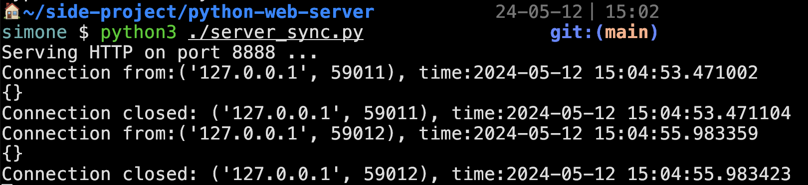
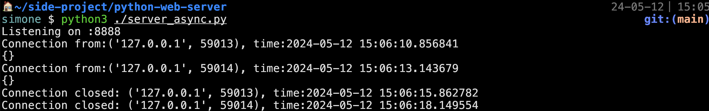

# python-web-server

## TODO

- [x] HTTP Request Parser
- [x] Body Parser: FormData
- [x] Body Parser: JSON
- [x] Sending Response
- [ ] Error handle / Validation
- [x] Threading

## Demo

### Server Sync

### Server Async

## Resource

- [Let’s Build A Web Server. Part 1.](https://ruslanspivak.com/lsbaws-part1/)
- [Let’s Build A Web Server. Part 2.](https://ruslanspivak.com/lsbaws-part2/)
- [Let’s Build A Web Server. Part 3.](https://ruslanspivak.com/lsbaws-part3/)
- [Part 5 - A simple HTTP server in python](https://mleue.com/posts/simple-python-tcp-server/)
- [Part 6 - A simple HTTP parser in python](https://mleue.com/posts/simple-python-http-request-parser/)
- [python doc - socket](https://docs.python.org/3/library/socket.html)
- https://low-orbit.net/python-tutorial-8
