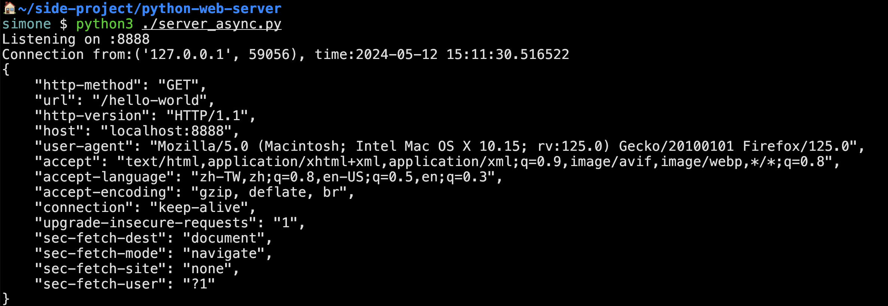

# python-web-server

## TODO

- [x] HTTP Request Parser
- [x] Body Parser: FormData
- [x] Body Parser: JSON
- [x] Sending Response
- [ ] Error handle / Validation
- [x] Threading

## Demo

### Server Sync

### Server Async

避免性能問題需要採取一些措施來有效管理並發揮系統資源的最大效能。以下是一些可以考慮的方法：

- 使用非阻塞IO（Non-blocking IO）或異步IO（Asynchronous IO）：這允許服務器在等待IO操作完成時繼續處理其他事務，而不必等待IO操作完成。這樣可以更有效地利用CPU和其他資源。
- 使用線程池或執行緒池：這可以限制同時運行的執行緒數量，以避免創建過多的執行緒導致系統負荷過重。通過管理執行緒池的大小，可以有效地控制資源使用。
- 控制並發連接數量：可以設置最大同時連接數量的限制，以確保服務器不會因為過多的連接而超負荷。可以根據服務器的性能和預期的負載來調整這個數量。
- 優化程式碼：檢查程式碼，尋找可能的效能瓶頸並進行優化。這包括避免不必要的資源浪費，使用高效的演算法和資料結構，以及最小化IO操作的次數。
- 監控系統資源：定期監控服務器的CPU使用率、內存使用量和網路流量等資源情況，及時發現並解決潛在的性能問題。
- 進行負載測試：在實際投入使用之前，進行負載測試，模擬實際使用情況下的高負載狀況，以確保服務器能夠在預期的負載下正常運行。

這些措施可以單獨使用，也可以結合使用，以確保服務器在處理多個連接時能夠保持良好的性能。

### HTTP Parser

## Resource

- [Let’s Build A Web Server. Part 1.](https://ruslanspivak.com/lsbaws-part1/)
- [Let’s Build A Web Server. Part 2.](https://ruslanspivak.com/lsbaws-part2/)
- [Let’s Build A Web Server. Part 3.](https://ruslanspivak.com/lsbaws-part3/)
- [Part 5 - A simple HTTP server in python](https://mleue.com/posts/simple-python-tcp-server/)
- [Part 6 - A simple HTTP parser in python](https://mleue.com/posts/simple-python-http-request-parser/)
- [python doc - socket](https://docs.python.org/3/library/socket.html)
- https://low-orbit.net/python-tutorial-8
